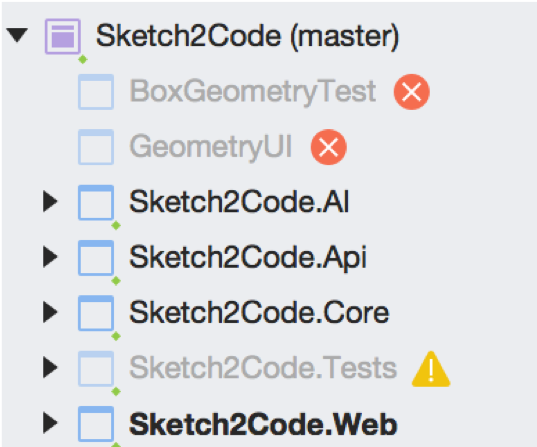
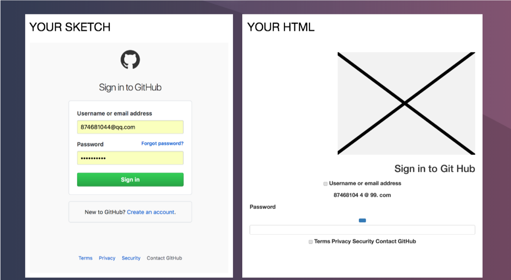
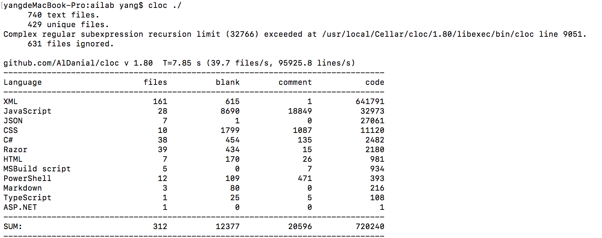
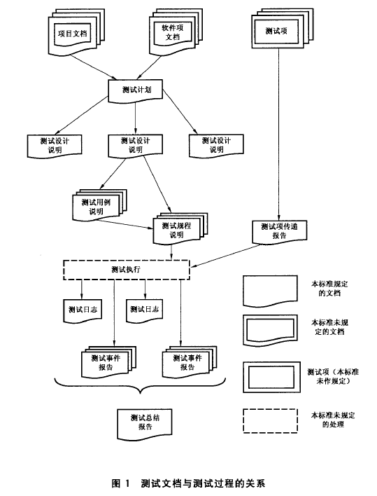
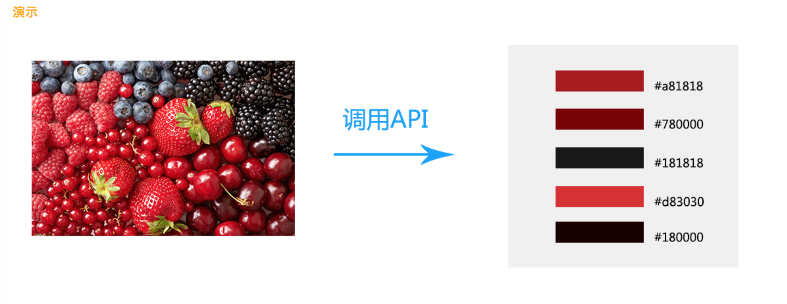

# Work of the First week! 
As I have already signed up in github. So I will not mention it there.
## 1.Git install 
Download git install package from [https://www.git-scm.com/download/](). I downloaded different version packages for Windows and MacOs. Then just click the package and select all default radio button. After finishing installing, then I will be able to use git command in cmd.
## 2.Account config
To config local user name and email, I use following commands:

```
git config --global user.name yangwenhao
git config --global user.email 874681044@qq.com
```

Then I go to config directory and create local ssh files by using following command:

```
cd ~/.ssh
ssh-keygen -t rsa -C "874681044@qq.com"
```
After that, I paste the content that is in file **id_rsa.pub** into github ssh adding textarea. At the same time, these two SSH keys are named after my different laptops of operating systems.
## 3.Create local directory
In my learning directory, I make a directory named MES as base directory. In cmd, I use following commands to create initialize a new respository and clone remote respository of our group. 

```
git init
git clone https://github.com/SoftwarEngineeringGroup/Daily-Work
```
## 4.Add remote respository
Copy my project url for add remote respository.

```
git add remote ywh https://github.com:Wenhao-Yang/Daily-Work.git
```

If adding succeeds, run following `git remote -v` will get such return:

```
ywh	https://github.com/Wenhao-Yang/Daily-Work.git (fetch)
ywh	https://github.com/Wenhao-Yang/Daily-Work.git (push)
```

## 5.Upload file for test
Create file named GitInstallYWH.txt to upload. There are three steps, and all of them could be done by commands.

```
git add GitInstallYWH.txt 
git commit -m "upload txt file for test"
git push
```

Then check if our operation is successful by opening [https://github.com/Wenhao-Yang/Daily-Work]() and searching for *GitInstallYWH.txt*.
## 6.Join the group team
Invited by the group owner, I was authorized with full access to our project. Fork our team respository to my workstation, so I can get the code from my remote respository with following commands:

```
git fetch origin master
git merge origin/master
git commit -m '合并到本地'
```

# Work of the second week!
This week, I read the code of project Sketch2Code. And I give my opinion about it. 
## 1.Overview
Using C#, Sketch2Code is a web solution for transform manuscript website to HTML. In cloud, AI is able to recognize controllers in imagines. And there are five modules.

-  A Microsoft Custom Vision Model: This model has been trained with images of different handwritten designs tagging the information of most common HTML elements like Buttons, TextBox and Image.
-  A Microsoft Computer Vision Service: To identify the text written into a design element a Computer Vision Service is used.
-  An Azure Blob Storage: All steps involved in the HTML generation process are stored, including original image, prediction results and layout grouping information.
-  An Azure Function: Serves as the backend entry point that coordinates the generation process by interacting with all the services.
-  An Azure Web App: User front-end to enable uploading a new design and see the generated HTML results. 

## 2.Source Code
There are five projects in Sketch2Code. For projects named BoxGeometryTest and GeometryUI, the author didn't share the code. And Sketch2Code.Tests can't be loaded in MacOS as it's programmed for Windows. And I won't discuss more about it here.



## 3.Website
Visiting [https://sketch2code.azurewebsites.net/](https://sketch2code.azurewebsites.net/), I've test some function of this project and find some problems.

### a.Image Upload
When I upload my design, there's no feedback during uploading. As I waited for almost 30s, uploading page come out.
### b.Handwriting Recogonition
Handwriting Recogonition in the project is not perfect as I expected. Except for Chinese recognition problems, there's mistakes even when I uploaded an image of printed web page.



### c.Web Page
In my opinion, there should be HTML code display in the page. In the future, we may contribute to design fuction that users may get visual code representation display.

# 第三/四周工作
这一周主要学习《构建之法》的13章内容，并对Sketch2Code项目进行初步的项目测试规划。
首先对项目进行代码统计，在MacOS下使用cloc工具，对Sketch2Code文件夹下的项目进行统计，得到如下结果：



其中主要的C#代码行数为**2482**行！

对于测试，可以将测试分为白盒测试和黑盒测试两部分。
## 测试内容
### 1.黑盒测试
黑盒测试部分主要通过对网站和代码后台的功能进行面向用户的测试，得到测试结果。
在网站[https://sketch2code.azurewebsites.net/](https://sketch2code.azurewebsites.net/)中，输入时图片。首先对输入进行等价类划分测试，这里向分为**无效等价类**和**有效等价类**。
对后台的测试,根据代码的部分逻辑进行。
#### a.无效等价类
因为在这里输入为上传图片文件，所以无效等价类可简单理解为无效的上传文件，一部分包括其他文件、非HTML图片和损坏的HTMl图片文件。
在这里分别进行其他类型文件的多次上传、非HTML图片和损坏HTML图片的上传测试，得到相应的结果并记录。

#### b.有效等价类
在这里，有效等价类包括手绘的HTML图片若干，以及网页HTML图片若干。并且这些图片包含了常见的HTML元素。

### 2.白盒测试
白盒测试通过对代码的阅读，设计测试。同样分为对网站部分和后台服务的测试。

## 标准测试
进行标准的软件测试，参照中华人民共和国国家标准的GB/T 9386——2008《计算机软件测试文档编制规范》进行测试以及文档编写。

**测试设计文档**
#### 测试计划
```
1.测试计划标识符
SKTP 1025

2.引言
2.1目标
Sketch2Code项目的测试计划要达到以下目标：
(1)	细化准备和进行系统测试所需要的活动；
(2)	与所有小组成员沟通每个人要执行的任务以及执行任务时所安排的进度；
(3)	确定用来准备计划的信息源；
(4)	确定进行系统测试所需要的测试工具和环境。
2.2背景
Sketch2Code 是一个基于 Web 的解决方案，使用 AI 将手绘的用户界面草图转换为可用的 HTML 代码。Sketch2Code 由微软和 Kabel、Spike Techniques 合作开发，于2018年7月份开始编写，至今已经大致实现了所有基础项目功能。
2.3范围
该项目测试计划覆盖了Sketch2Code项目的全部系统测试，包括操作者、用户规程以及程序和作业控制。除了综合性程序功能性测试以外，还包括接口、安全、恢复和性能。
2.4引用文件
下列是此次测试计划的参考信息源：
https://github.com/Microsoft/ailab/blob/master/Sketch2Code/README.md
https://www.oschina.net/p/sketch2code

3.测试项
组成Sketch2Code项目的所有项在系统测试期间予以测试。测试的程序版本以Github上的项目为准，进行测试。
要测试的各项列出如下：
3.1程序模块
要测试的程序模块按照以下规则来标识：
类型	库	成员名称
源代码		
可执行代码		
		
3.2作业控制规程
应用程序、分类和实用程序的控制规程标识如下：
类型	库	成员名称
		
		
		
3.3用户规程
Sketch2Code项目根据日常用户使用，讨论同意规程进行测试。

4.要测试的特征
测试设计	
说明编号	描述
	
	
	
	
	

5.不要测试的特征
下面的测试不应包括在系统测试中，一方面接触不到这部分代码和功能，自己构建太过复杂。
	训练识别组件的AI训练系统；
	以及其他的cloudAI服务等。
	
6.方法
测试小组成员根据项目的自己了解，讨论综合准备所有的测试计划、用例以及规程说明。这种方法应验证测试所覆盖的那些领域的测试文档集信息的准确性和综合性。
6.1转换测试
除了计算输入和输出的记录以外，转换数据集应以两种方式进行验证。第一种验证方式是，数据测试的数据审核人员应该核对数据集中的数据范围，并记录数据元之间的关系。第二种验证方法是分别随机选取不同数据集中“r”和“c”条数据，并与对应生成的结果进行比较。
6.2接口测试
```
**测试说明包括三类文档**：
#### a) 测试设计说明
详述测试方法，标识测试设计和相关测试所覆盖的特征，以及完成测试和规定特征的通过准则所需要的测试用例和测试规程
#### b) 测试用例说明
将用于输入的实际值以及预期的输出形成文档。
#### c) 测试规程说明
标识为实施相关测试设计而运行系统并执行规定测试用例所需要的所有步骤

**测试报告包括四类文档**：
#### a) 测试项传递报告
指明正式测试下进行测试而被传递的测试项
#### b) 测试日志
记录测试执行期间发生的情况
#### c) 测试事件报告
记录测试执行期间发生并需进一步调查的任何事件
#### d) 总结报告
总结测试活动和结果的文档

##项目改进

完成项目测试项目后将得到测试文档若干。然后对项目的改进设想做进一步阐释和尝试实现。同样包括对网站和后台的改进两方面的思路。
###网站
* 为上传图片添加反馈信息

* 添加展示HTMl代码的控件
通过我们对网站的代码分析，我们发现当点击上传文档后，后台的监控函数是：

```
document.getElementById('imageData').onchange = function (e) {
            loadImage(
                e.target.files[0],
                function (img) {
                    img.setAttribute("id", "myCanvas");
                    img.setAttribute("style", "margin-left:-10000px;");
                    document.body.appendChild(img);
                    var base64image = img.toDataURL("image/png");
                    base64image = base64image.replace('data:image/png;base64,', '');
                    sendFileToServer(base64image);
                },
                { maxWidth: 600, canvas: true, orientation: true } // Options
            );
        };

```

在此基础上，我们可以修改代码，实现上传反馈！

* 临时存储
网站的临时存储，可以通过使用HTML5的localStorage来实现。sessionStorage用于存储时，当会话结束的时候，sessionStorage中的键值对会被清空，而localStorage属于永久性存储。

###后台
* 颜色识别
寻找互联网上开放的颜色识别接口纳入工程中来,下面是**我知图**[http://www.tudatech.com/apiUser/doc?doc=6](http://www.tudatech.com/apiUser/doc?doc=6)的图片颜色识别的api官网实例。



